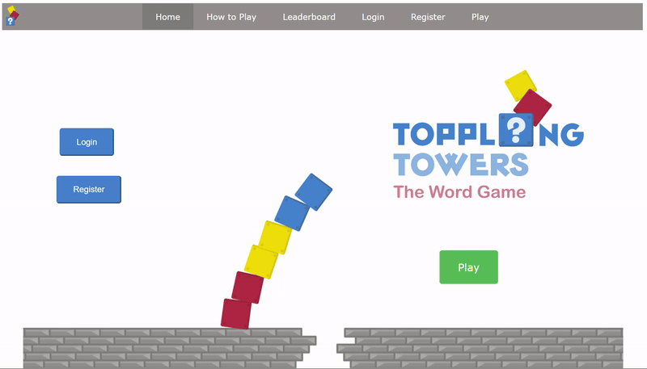
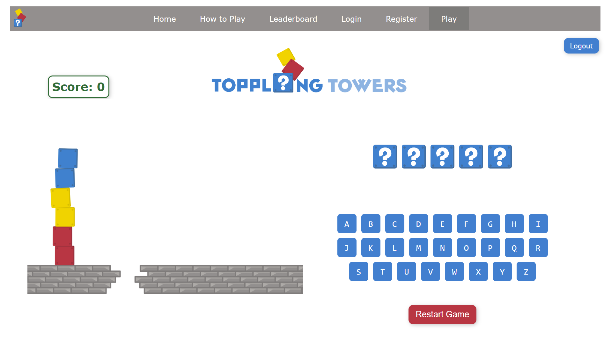

# Toppling Towers – Browser-Based Game

## Overview
Toppling Towers is a browser-based game built using HTML, CSS, and JavaScript.
The project focuses on modular JavaScript design, user interaction, and clear separation of concerns in a frontend-only application.

## Screenshots

### Home Page

### Gameplay

**Note:** Because this project uses modular JavaScript and relative asset paths, it needs to be run via a local server for styles and scripts to load correctly.

## How to run locally 
1. Clone the repository
2. Open the project folder in VS Code
3. Open Index.html with live server 

## Features
- Interactive game logic
- User registration and login
- Score tracking and leaderboard
- Persistent state using browser storage
- Responsive, user-focused interface

## Technical Approach
- Modular JavaScript structure to keep logic maintainable and readable
- Separation between game logic, user management, and leaderboard functionality
- Client-side persistence using localStorage and sessionStorage
- Designed to run entirely in the browser without a backend

## Design & UX
All visual assets, UI elements, and branding for this project were designed by me using **Affinity Designer**.
I wanted the interface to feel approachable and engaging while still being clear and functional for users.

## Why I Built This
I built this project to challenge myself to create a complete, user-facing application from scratch — from logic and structure through to visual design and user experience.

## What I Learned
- Structuring JavaScript projects beyond a single file
- Balancing technical decisions with user experience
- Designing interfaces with non-technical users in mind
- Communicating technical ideas through visual and interactive elements

## What I’d Improve Next
- Introduce a backend service for authentication and persistence
- Containerise the application for easier deployment
- Explore hosting and CI/CD workflows
- Extend the word set to include longer, more complex words to offer adjustable difficulty and improved replayability

